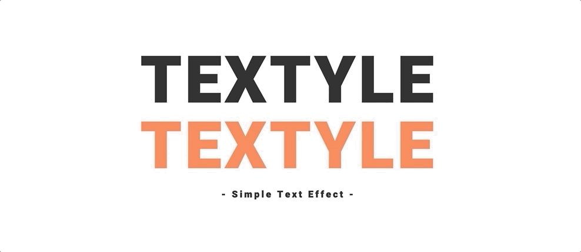

<!-- README.md is generated from README.Rmd. Please edit that file -->

[](https://CRAN.R-project.org/package=textyle)
[](https://gitlab.com/lgnbhl/textyle/pipelines)

# textyle 

> Add beautiful text effects in your Shiny apps

The `textyle` package allows to reproduce the beautiful text effects
from [Textyle.js](https://github.com/mycreatesite/Textyle.js/) in a
Shiny app.



### Shiny

To animate a text, simply call `textyle()` on any tag element from
`tags()`.

``` r
library(shiny)
library(textyle)
 
shinyApp(
  ui = fluidPage(
      align = "center",
      br(), br(), br(),
      textyle(tags$p("TEXTYLE", style = "font-size:7rem;font-weight:900;")),
      textOutput("text")
  ),
  server = function(input, output){
    output$text <- renderText({ print("- Simple Text Effect -") })
  }
)
```

### Customize it

You can change the color, the easing (see
[jquery-easing](http://gsgd.co.uk/sandbox/jquery/easing/) for all
options availables) or the speed of the text effect.

To reproduce the non colored effect, change the color to black and add
`class = "ex1"` in the function.

``` r
textyle(p("TEXTYLE"), color = "black", class = "ex1")
```

The reproduced text effects are taken from [this
codepen](https://codepen.io/mycreatesite/pen/vvpmgy).
